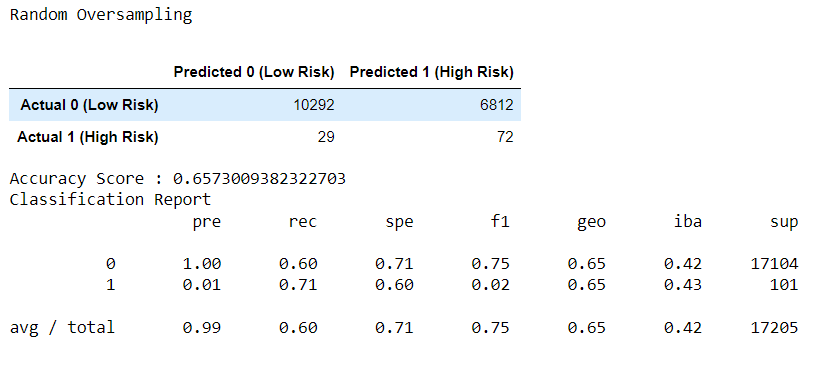
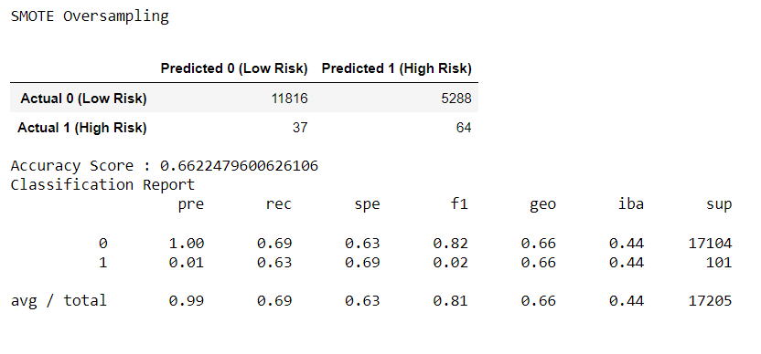
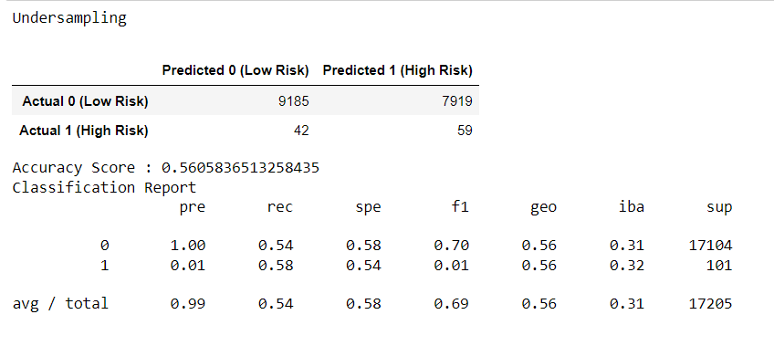
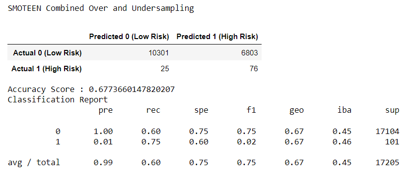
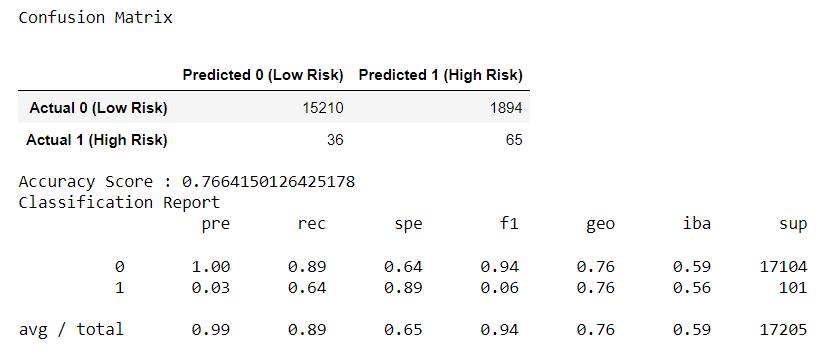
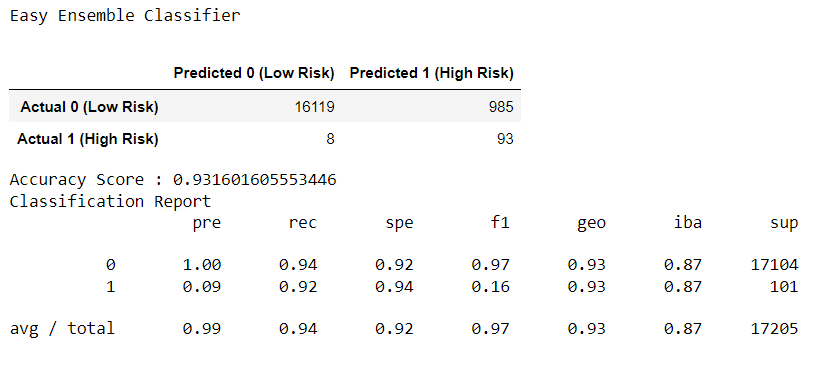

# Credit_Risk_Analysis

## Overview of Project  

**Purpose:**  
The purpose of this project is to use different models of supervised machine learning to predict credit risk for loans.  

## Resources:  
- Data Source: LoanStats_2019Q1.csv  
- Software: Anaconda 4.10.3, Python 3.9.7, Jupyter Notebook 6.4.5, scikit-learn 0.24.2, imbalanced-learn 0.7.0  

## Analysis and Results  

**Analysis:**  
The following models were used for this project:  
- Logistic Regression - Random Oversampling  
- Logistic Regression - SMOTE Oversampling  
- Logistic Regression - Undersampling  
- Logistic Regression - SMOTEEN Combined Over and Undersampling  
- Balanced Random Forest Classifier  
- Easy Ensemble Classifier  

The following calculations were performered for each model of analysis:  
- Accuracy Score  
  - measures how many obervations our model predicted correctly.  
  - acc = TP + TN / (Total observations)  
- Precision  
  - measures the reliability of a positive classification.  
  - pre = TP / (TP + FP)  
- Recall/Sensitivity  
  - measures the ability to find all positive samples.  
  - rec = TP / (TP + FN)  
- F1 Score  
  - single summary statistic of precision and sensitivity.  
  - F1 = 2 (pre * rec) / (pre + rec)  

||Predicted Low Risk|Predicted High Risk|
|:-:|:----------------:|:-----------------:|
|Actual Low Risk|True Positive (TP)|False Negative (FN)|
|Actual High Risk|False Positive (FP)|True Negative (TN)|

**Results:**  
We can see from the images below, Easy Ensemble Classifier model had the highest accuracy score of 94%. While Logistic Regression - Undersampling model had the lowest accuracy score of 54%.  

  
  
  
  
  
  

## Summary  

**Conclusion**  
One thing to consider would be false positive result (high risk applicants identified as low risk). This would approve high risk applicants for loans when they should be denied, as they may not be able to pay off their loans. A model with high precision will have lower false positive results. Another consideration would be false negative result (low risk applicants identified as high risk). This would deny more people for loans who may have been a good candidate for loans. A model with high recall/sensitivity will have a lower false negative results. I would recommend the Easy Ensemble Clasifier model because it resulted in the highest accuracy, precision, and recall/sensitivity values when compared to the other models.  

### Codes Used  
(Please look at specific files for codes used)  
Code for [Over Under Resampling](https://github.com/tonywang3571/Credit_Risk_Analysis/blob/master/credit_risk_resampling.ipynb)   
Code for [Balanced Random Forest and Easy Ensemble Classifier](https://github.com/tonywang3571/Credit_Risk_Analysis/blob/master/credit_risk_ensemble.ipynb)  
